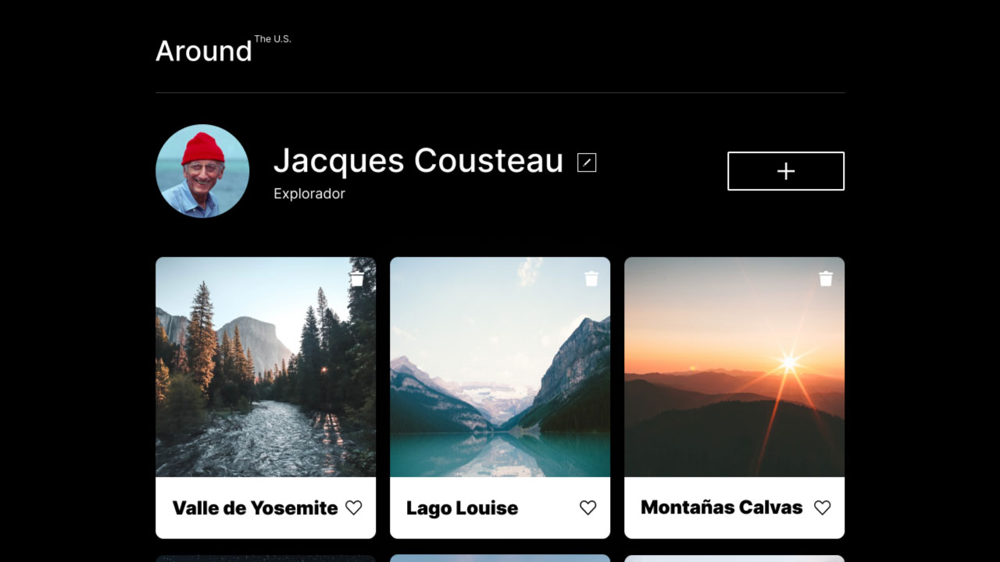

# Around The US - React

## 📋 Descripción

Aplicación web interactiva que permite a los usuarios compartir y gestionar tarjetas de lugares. Los usuarios pueden actualizar su perfil, agregar nuevas tarjetas con lugares, dar "me gusta" y eliminar sus propias tarjetas.

Este proyecto es una versión React de la aplicación "Around the US", parte del bootcamp de desarrollo web de TripleTen.



## 🚀 Características

- ✅ Edición de perfil de usuario (nombre y descripción)
- ✅ Actualización de foto de avatar
- ✅ Creación de nuevas tarjetas con lugares
- ✅ Sistema de likes en tarjetas
- ✅ Eliminación de tarjetas con confirmación
- ✅ Vista ampliada de imágenes
- ✅ Diseño responsive
- ✅ Integración con API REST

## 🛠️ Tecnologías Utilizadas

- **React** 18+ - Biblioteca de JavaScript para interfaces de usuario
- **Vite** - Herramienta de construcción rápida
- **JavaScript (ES6+)** - Lenguaje de programación
- **CSS3** - Estilos y diseño responsive
- **Fetch API** - Para consumir la API REST
- **Context API** - Gestión de estado global

## 📁 Estructura del Proyecto

```
src/
├── assets/              # Recursos estáticos (imágenes, iconos)
├── components/          # Componentes React
│   ├── Header/          # Componente de encabezado
│   ├── Footer/          # Componente de pie de página
│   ├── Main/            # Componente principal
│   │   └── Popup/       # Componentes de ventanas emergentes
│   └── Cards/           # Componente de tarjetas
├── contexts/            # Context API de React
│   └── CurrentUserContext.js
├── utils/               # Utilidades y configuración de API
│   └── api.js
├── index.css            # Estilos globales
└── main.jsx             # Punto de entrada
```

## 🔧 Instalación y Configuración

### Prerrequisitos

- Node.js (versión 14 o superior)
- npm o yarn

### Pasos de Instalación

1. **Clonar el repositorio**
   ```bash
   git clone <url-del-repositorio>
   cd web_project_around_react
   ```

2. **Instalar dependencias**
   ```bash
   npm install
   ```

3. **Ejecutar en modo desarrollo**
   ```bash
   npm run dev
   ```

4. **Abrir en el navegador**
   - La aplicación se abrirá automáticamente en `http://localhost:5173`

## 📦 Scripts Disponibles

```bash
npm run dev          # Inicia el servidor de desarrollo
npm run build        # Construye la aplicación para producción
npm run preview      # Previsualiza la versión de producción
npm run lint         # Ejecuta el linter (si está configurado)
```

## 🌐 API

La aplicación consume una API REST para gestionar usuarios y tarjetas:

**Base URL:** `https://around-api.es.tripleten-services.com/v1`

### Endpoints principales:

- `GET /users/me` - Obtener información del usuario
- `PATCH /users/me` - Actualizar perfil del usuario
- `PATCH /users/me/avatar` - Actualizar avatar
- `GET /cards` - Obtener todas las tarjetas
- `POST /cards` - Crear nueva tarjeta
- `DELETE /cards/:cardId` - Eliminar tarjeta
- `PUT /cards/:cardId/likes` - Dar like a una tarjeta
- `DELETE /cards/:cardId/likes` - Quitar like de una tarjeta

## 🎨 Componentes Principales

### App.jsx
Componente raíz que gestiona el estado global y la lógica de negocio principal.

### Main.jsx
Componente principal que renderiza el perfil del usuario y las tarjetas.

### CurrentUserContext
Context API para gestionar el estado del usuario actual en toda la aplicación.

### Popups
- **EditProfile** - Editar nombre y descripción del usuario
- **EditAvatar** - Cambiar foto de perfil
- **NewCard** - Agregar nueva tarjeta
- **ImagePopup** - Ver imagen ampliada
- **RemoveCard** - Confirmar eliminación de tarjeta

## 🔐 Autenticación

La aplicación utiliza un token de autorización en los headers de las peticiones HTTP:

```javascript
headers: {
  authorization: "tu-token-aqui",
  "Content-Type": "application/json",
}
```

## 📱 Responsive Design

La aplicación es completamente responsive y se adapta a:
- 📱 Dispositivos móviles (320px+)
- 📱 Tablets (768px+)
- 💻 Desktop (1280px+)

## 🚧 Próximas Mejoras

- [ ] Autenticación de usuarios (login/registro)
- [ ] Validación de formularios más robusta
- [ ] Manejo de estados de carga
- [ ] Mensajes de error más descriptivos
- [ ] Tests unitarios y de integración
- [ ] Modo oscuro

## 👨‍💻 Autor

**Lucero Uzuriaga**

## 📄 Licencia

Este proyecto es parte del programa educativo de TripleTen.

## 🙏 Agradecimientos

- TripleTen por el programa de formación
- API REST proporcionada por TripleTen

---

⭐ **¿Te gustó el proyecto? ¡Dale una estrella!**